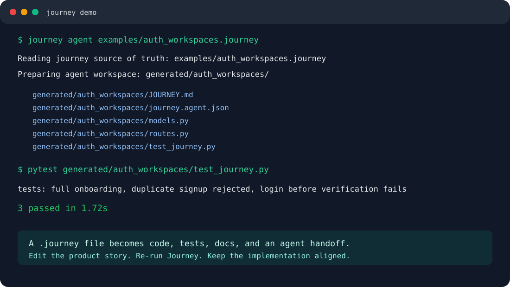

<p align="center">
  <h1 align="center">Journey</h1>
  <p align="center">
    <strong>Lightweight product maps for coding agents.</strong><br/>
    Keep repo intent, pages, API routes, acceptance, and agent handoffs in linked `.journey` files.
  </p>
</p>

<p align="center">
  <a href="https://github.com/sharziki/journey/actions/workflows/ci.yml"></a>
  
  
  <a href="LICENSE"></a>
</p>

<p align="center">
  <a href="#2-minute-quickstart">Quickstart</a> &bull;
  <a href="#before-journey--after-journey">Before/After</a> &bull;
  <a href="#demo">Demo</a> &bull;
  <a href="#examples">Examples</a> &bull;
  <a href="#adapters-roadmap">Adapters</a> &bull;
  <a href="#contributing">Contributing</a>
</p>

<p align="center">
  
</p>

Journey is a small open-source CLI for mapping product intent in `.journey` files.

Core Journey is lightweight: it creates, links, validates, and summarizes repo/page/API journeys without requiring a database, server, framework, or generated app.

Adapters are optional. The first adapter compiles structured backend journeys into a working FastAPI app with SQLAlchemy models, Pydantic schemas, route handlers, generated pytest acceptance tests, and agent-readable handoff files.

The bigger idea is simple: agents should not start from scattered prompts. They should read the project spine, build against it, test against it, and repair drift when the code no longer matches the story.

## 2 Minute Quickstart

Install Journey, then create a lightweight journey map for any repo:

```bash
python -m pip install journey-lang
journey create .
journey status .
```

For local development from this repo:

```bash
git clone https://github.com/sharziki/journey.git
cd journey
python -m pip install -e ".[dev]"
```

That writes a linked `.journey` graph:

```text
.journey/
├── repo.journey
├── pages/*.journey
├── apis/*.journey
├── JOURNEY_FLOW.md
└── README.md
```

`JOURNEY_FLOW.md` is the single read-through document: route map, linked journeys, source files, feature flow, and acceptance outline. When source files are present, Journey also lifts obvious signals like buttons, links, API calls, route methods, and response statuses into the generated docs.

Then use the graph:

```bash
journey validate .
journey sync .
journey doctor .
journey diff .
journey agent .
journey watch . --once
```

No database, server, or code generator is required for the core workflow.

Use the optional FastAPI adapter when you want generated backend code:

```bash
journey agent examples/auth_workspaces.journey
```

That reads a structured backend journey, generates FastAPI code, writes the agent handoff, and runs generated acceptance tests.

You should see:

```text
3 passed
Journey accepted: generated implementation satisfies current acceptance tests.
```

Run the optional generated API:

```bash
journey run examples/auth_workspaces.journey
```

Open:

```text
http://127.0.0.1:8000/docs
```

Create a readable route and feature map for a structured backend journey:

```bash
journey create examples/auth_workspaces.journey
```

The optional generated backend lives at:

```text
generated/auth_workspaces/
├── JOURNEY.md
├── journey.agent.json
├── app.py
├── database.py
├── models.py
├── routes.py
├── schemas.py
└── test_journey.py
```

## Before Journey / After Journey

| Before Journey | After Journey |
|----------------|---------------|
| Product behavior lives in prompts, tickets, docs, and memory | Product behavior lives in linked `.journey` files |
| Agents repeatedly ask for context | Agents read `JOURNEY.md` and `journey.agent.json` |
| New pages and routes appear without product context | `journey sync`, `doctor`, and `diff` expose drift |
| "Done" is subjective | journey acceptance and project QA give agents a checklist |
| New contributors must reverse-engineer intent | New contributors start with the journey graph |

## Demo

<p align="center">
  
</p>

The current demo is a screenshot-style terminal capture. A short GIF belongs here next: create a journey graph, run `journey status`, `journey doctor`, and `journey watch . --once`.

## How It Works

Core mode:

```text
repo folder
     |
     v
.journey/repo.journey + linked page/API journeys
     |
     v
Journey graph resolver
     |
     v
JOURNEY.md + journey.agent.json
     |
     v
Agent implementation / repair loop
```

Adapter mode:

```text
.journey file
     |
     v
Parser + validator
     |
     v
FastAPI codegen + agent manifest
     |
     v
Generated pytest acceptance tests
     |
     v
Agent repair loop
```

The `.journey` graph is the portable product contract. Generated code is optional adapter output that you can inspect, edit, test, deploy, or replace later.

## Structured Adapter Example

```journey
journey "Auth API" {
  entity User {
    email     string unique
    password  string hashed
    status    state(pending -> active -> suspended)
  }

  step signup {
    actor anonymous
    input {
      email     string required format(email)
      password  string required min(8)
    }
    action {
      user = create User(email: input.email, password: input.password, status: pending)
    }
    output {
      user_id user.id
    }
  }
}
```

The FastAPI adapter turns structured flows like this into:

- SQLAlchemy models
- Pydantic request/response schemas
- FastAPI route handlers
- state transition guards
- password hashing for `hashed` fields
- generated pytest scenarios
- `JOURNEY.md` for humans and agents
- `journey.agent.json` for tools and coding agents

## Examples

The repo includes a lightweight graph example and structured backend examples you can run today:

| Example | What it proves | Try it |
|---------|----------------|--------|
| `examples/lightweight_client_portal` | Repo/page/API journey graph with no database or generated app | `journey status examples/lightweight_client_portal` |

Structured adapter examples:

| Example | What it proves | Try it |
|---------|----------------|--------|
| `examples/auth_workspaces.journey` | SaaS signup, email verification, login, workspace creation, invitations | `journey agent examples/auth_workspaces.journey` |
| `examples/crm_sales_pipeline.journey` | CRM accounts, contacts, deals, and qualification | `journey test examples/crm_sales_pipeline.journey --clean` |
| `examples/ai_receptionist_backend.journey` | AI receptionist call capture and appointment booking | `journey test examples/ai_receptionist_backend.journey --clean` |
| `examples/car_dealership_leads.journey` | Dealer lead capture, contact, and test-drive scheduling | `journey test examples/car_dealership_leads.journey --clean` |
| `examples/library_borrowing.journey` | Library members, login/session flow, authenticated borrow and return | `journey test examples/library_borrowing.journey --clean` |
| `examples/journey_spine.journey` | Journey dogfooding itself as an agent-readable project spine | `journey agent examples/journey_spine.journey` |

Run every shipped example:

```bash
journey validate examples/lightweight_client_portal
journey doctor examples/lightweight_client_portal
journey diff examples/lightweight_client_portal --check
for f in examples/*.journey; do
  journey test "$f" --clean
done
```

## Dogfooding Journey

Journey uses `.journey` files as its own project spine. For this repo, the structured examples still provide the strongest acceptance coverage:

When an agent enters this repo, it should:

```bash
find . -name "*.journey" -not -path "./generated/*"
journey agent examples/journey_spine.journey
journey agent examples/auth_workspaces.journey
```

Then it should read:

```text
generated/<journey>/JOURNEY.md
generated/<journey>/journey.agent.json
```

That handoff tells the agent what the product is, what still needs to be built, and what acceptance tests must pass.

## Agent Mode

Use this when you want Journey to prepare a handoff without spawning another agent:

```bash
journey agent .
```

Use this when a local coding-agent runtime is configured and you want the deliverable loop:

```bash
journey execute . --autonomous
```

`execute --autonomous` currently auto-detects Codex CLI when available. If you use another runtime, set `JOURNEY_AGENT_COMMAND` or use `journey watch`.

```bash
journey watch product.journey \
  --agent-command "codex exec \"Work on: {item}. Read {handoff_md} and {handoff_json}.\""
```

Structured backend journeys still work with the same commands:

```bash
journey agent examples/auth_workspaces.journey
journey execute examples/auth_workspaces.journey --autonomous
```

## CLI Reference

| Command | What it does |
|---------|--------------|
| `journey agent <path>` | Write agent handoff files from a lightweight journey graph, or run adapter generation for a structured backend journey |
| `journey create [path]` | Create linked repo/page/API journeys plus a read-through `JOURNEY_FLOW.md`, or write a route and feature flow document for an existing `.journey` |
| `journey sync [path]` | Rescan a project and add missing page/API journeys without overwriting edited specs, then refresh the flow document |
| `journey doctor [path]` | Check graph health: missing links, orphan journeys, stale sources, missing specs, and acceptance gaps |
| `journey diff [path]` | Show drift between code files and linked Journey files, with `--check` for CI |
| `journey status [path]` | Show a one-screen Journey summary and next command |
| `journey execute <path> --autonomous` | Run the deliverable-by-deliverable builder/QA loop with a local agent runtime |
| `journey watch <path>` | Lower-level watch loop for lightweight graphs or structured backend journeys |
| `journey compile <file>` | Optional adapter: generate a FastAPI project |
| `journey test <file>` | Optional adapter: compile and run generated pytest scenarios |
| `journey run <file>` | Optional adapter: compile and start the generated FastAPI app with uvicorn |
| `journey inspect <path>` | Print a lightweight journey graph or structured journey AST |
| `journey validate <path>` | Validate graph links or structured cross-references before generation |
| `journey manifest <path>` | Generate `JOURNEY.md` and `journey.agent.json` from a lightweight graph or structured journey |
| `journey shape <file>` | Shape loose natural-language input into a handoff |

## Handwritten Journeys

The long-term format is natural-language first:

```journey
journey "Workspace Invite"

design: ./design.md

mission:
  Let a workspace owner invite a teammate and know exactly what happened.

pages:
  - Signup
  - Verify Email
  - Workspace Home
  - Invite Teammate

page "Invite Teammate":
  purpose:
    Let a workspace owner invite another person by email and role.

  acceptance:
    - owner can invite a teammate
    - non-owner cannot invite
    - duplicate invitation is rejected
```

Loose handwritten journeys can already be shaped into a readable handoff:

```bash
journey shape idea.journey
```

The FastAPI adapter also compiles the structured backend syntax in `examples/*.journey`.

See [docs/handwritten-journey-format.md](docs/handwritten-journey-format.md) and [docs/design.md](docs/design.md).

## Adapters Roadmap

FastAPI is the first working codegen adapter. The point of Journey is that the `.journey` graph should outlive any one framework.

Planned adapters:

| Adapter | Target |
|---------|--------|
| Next.js frontend generation | Pages, forms, route handlers, flow-aware UI states |
| Supabase | Auth, Postgres schema, row-level security policies, edge functions |
| Prisma | Schema generation and typed model access |
| Django | Models, views, serializers, admin, and tests |
| Node/Express | Routes, middleware, validation, and integration tests |

Other useful targets:

- OpenAPI export
- QA checklists
- seed data
- browser automation scripts
- support and operations playbooks
- agent task plans

## Project Structure

```text
journey/
├── parser/      # lexer, recursive descent parser, AST dataclasses
├── core/        # validation, normalization, config
├── codegen/     # FastAPI, SQLAlchemy, Pydantic, pytest generation
├── adapters/    # adapter wrappers and markdown handoff output
└── cli/         # journey command line interface
```

## Status

Journey is v0.2.1 beta. The core lightweight journey graph workflow and FastAPI adapter are usable today, with CI covering unit tests, shipped examples, generated acceptance tests, package builds, and release artifacts.

Working today:

- lightweight linked repo/page/API journeys under `.journey/`
- folder-level agent handoffs with no database or runtime requirement
- graph-aware `inspect` and `validate` commands for linked journeys
- `doctor` health checks for missing links, orphan journeys, stale sources, missing specs, and acceptance gaps
- `diff` for readable code-vs-journey drift
- `status` for one-screen project summaries
- lightweight `watch` / `execute` loops for graph-based projects
- structured `.journey` syntax
- parser and semantic validation
- FastAPI backend generation
- SQLAlchemy model generation
- Pydantic schema generation
- generated pytest acceptance tests
- agent-facing `JOURNEY.md`
- machine-readable `journey.agent.json`

Still early:

- natural-language journeys are agent-readable today, but not yet a full codegen target
- FastAPI is the only codegen adapter today
- autonomous execution depends on a configured local agent runtime
- the codegen should keep gaining examples across domains to force generalization

## Roadmap

- [x] Agent handoff files: `JOURNEY.md` and `journey.agent.json`
- [x] Lightweight folder-level Journey graph handoff
- [x] `create`, `sync`, `status`, `doctor`, and `diff` for lightweight graphs
- [x] Lightweight `watch` and `execute`
- [x] Structured v0.1 syntax: entities, steps, state machines, tests
- [x] Parser: lexer + recursive descent to typed AST
- [x] FastAPI code generation: models, schemas, routes, tests
- [x] SaaS auth/workspaces example
- [x] CRM example
- [x] AI receptionist backend example
- [x] Car dealership lead system example
- [x] Library borrowing example with authenticated member/session flow
- [x] Journey dogfoods itself with `examples/journey_spine.journey`
- [ ] GIF demo for README
- [ ] Natural-language journey sections as first-class compiler input
- [ ] More framework route detectors for `journey create` / `sync`
- [ ] Journey graph editor/refinement commands
- [ ] Generic action/event system for emails, webhooks, tasks, and side effects
- [ ] Repair ledger for failed checks and drift
- [ ] OpenAPI export
- [ ] Next.js frontend generation
- [ ] Supabase adapter
- [ ] Prisma adapter
- [ ] Django adapter
- [ ] Node/Express adapter

## Contributing

The best contributions right now are examples that make Journey more general.

Good first PRs:

1. Add a lightweight `.journey` graph for a real app structure.
2. Add a structured `.journey` file for a real backend workflow.
3. Run `journey doctor`, `journey diff --check`, or `journey test` depending on the example type.
4. If it fails, improve the graph scanner, validator, or adapter without deleting acceptance coverage.
5. Add the example to this README.

Useful example areas:

- SaaS onboarding and billing
- CRM workflows
- receptionist and appointment systems
- dealership lead routing
- marketplace orders
- clinic intake
- field service scheduling

## Release Checks

```bash
python -m pytest
journey validate examples/lightweight_client_portal
journey doctor examples/lightweight_client_portal
journey diff examples/lightweight_client_portal --check
for f in examples/*.journey; do
  journey validate "$f" --strict
  journey test "$f" --robustness strict --clean
done
python -m build
python -m twine check dist/*
```

## License

MIT
