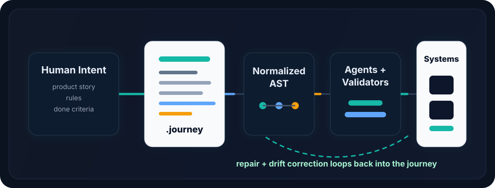

<p align="center">
  <h1 align="center">Journey</h1>
  <p align="center">
    <strong>The source-of-truth runtime for autonomous software engineering.</strong><br/>
    Write the intent once. Agents generate, validate, repair, and evolve the implementation toward it.
  </p>
</p>

<p align="center">
  <a href="https://github.com/sharziki/journey/actions/workflows/ci.yml"></a>
  
  
  <a href="LICENSE"></a>
</p>

<p align="center">
  <a href="#how-journey-works">How it works</a> &bull;
  <a href="#in-30-seconds">30 seconds</a> &bull;
  <a href="#why-this-is-different">Why different</a> &bull;
  <a href="#what-gets-generated">Generated output</a> &bull;
  <a href="#journey-files">Journey Files</a> &bull;
  <a href="#roadmap">Roadmap</a>
</p>

<p align="center">
  
</p>

---

**From product story -> working system.**

Journey turns a `.journey` file into durable project memory for agents: what the product is, how it should behave, what done means, what is broken, and what cleanup work still needs to happen.

The current v0.1 proves the first slice: a structured journey compiles into a working FastAPI backend with SQLAlchemy models, Pydantic schemas, routes, and pytest coverage.

The bigger direction is more important:

> Agents should not just generate code. They should keep moving a system toward its source of truth.

## The Problem

AI coding agents are powerful, but most of them are still prompt-driven.

They repeatedly re-learn context, hallucinate contracts, patch symptoms, and lose the product intent across files, chats, tickets, docs, and tests.

Journey gives agents a persistent spine:

- What are we building?
- What behavior matters?
- What does done mean?
- What should be tested?
- What drift still needs repair?
- Which agent should pick up the next pass?

## How Journey Works

<p align="center">
  
</p>

```text
Human Intent
      |
      v
  .journey file
      |
      v
 Normalized AST
      |
      v
 Agents + Validators
      |
      v
 Generated Systems
      |
      v
 Repair + Drift Correction
```

## Why This Is Different

| Traditional AI Coding | Journey |
|-----------------------|---------|
| Prompt-driven | Intent-driven |
| Stateless | Persistent context |
| Generates snippets | Maintains systems |
| Re-learns architecture | Reads the project spine |
| Patches symptoms | Repairs against acceptance |
| Treats tests as optional | Makes tests part of the story |
| Ends after a response | Keeps cycling until the journey is done |

## In 30 Seconds

Describe a system:

```journey
journey "Auth API" {
  entity User {
    email     string unique
    password  string hashed
    status    state(pending -> active -> suspended)
  }

  step signup {
    input {
      email     string required format(email)
      password  string required min(8)
    }
    action {
      user = create User(email: input.email, password: input.password, status: pending)
    }
    output {
      user_id user.id
    }
  }
}
```

Generate and run it:

```bash
python -m pip install -e ".[dev]"
journey execute examples/auth_workspaces.journey --autonomous
journey run examples/auth_workspaces.journey
```

Open the generated API docs at `http://127.0.0.1:8000/docs`.

You now have:

- FastAPI routes
- SQLAlchemy models
- Pydantic schemas
- state transition guards
- generated pytest acceptance tests
- agent-facing `JOURNEY.md`
- machine-readable `journey.agent.json`
- OpenAPI docs through FastAPI

## What Gets Generated

```text
generated/auth_workspaces/
├── JOURNEY.md            # agent-readable implementation checklist
├── journey.agent.json    # machine-readable project spine
├── app.py                # FastAPI app entrypoint
├── database.py           # SQLAlchemy engine/session setup
├── models.py             # generated SQLAlchemy models
├── routes.py             # generated route handlers
├── schemas.py            # generated Pydantic schemas
└── test_journey.py       # generated acceptance tests
```

The output is normal application code. You can inspect it, edit it, test it, deploy it, or replace it with another adapter.

## Agent Mode

Any AI coding terminal can use the same ritual:

```bash
find . -name "*.journey" -not -path "./generated/*"
journey execute <file.journey> --autonomous
```

`journey execute --autonomous` auto-detects a local coding agent runtime, currently Codex CLI when available, and runs the deliverable loop.

Under the hood, each deliverable gets:

- a fresh builder session
- the current `JOURNEY.md`
- the current `journey.agent.json`
- a QA pass after the builder exits
- advancement to the next deliverable only after QA passes

If you only want to prepare the handoff without spawning an agent, use:

```bash
journey agent <file.journey>
```

That command:

- validates the journey strictly
- generates the implementation
- writes `JOURNEY.md`
- writes `journey.agent.json`
- runs generated acceptance tests
- prints the next loop an agent should follow

The lower-level runner is also available:

```bash
journey watch examples/auth_workspaces.journey
```

`watch` is useful for custom runtimes, but most users should start with `execute --autonomous`.

## Handwritten Journeys

The intended `.journey` format is natural-language first.

At the top level, a journey should be able to say:

```journey
journey "Workspace Invite"

design: ./design.md

mission:
  Let a workspace owner invite a teammate and know exactly what happened.

pages:
  - Signup
  - Verify Email
  - Workspace Home
  - Invite Teammate

page "Invite Teammate":
  purpose:
    Let a workspace owner invite another person by email and role.

  user sees:
    - teammate email
    - role selector
    - send invite button
    - invitation status

  acceptance:
    - owner can invite a teammate
    - non-owner cannot invite
    - duplicate invitation is rejected
```

That format is the direction: high-level pages and flows first, then readable per-page specs, acceptance, cleanup, and optional `design.md` references. The v0.1 compiler still uses the structured backend syntax for generation.

If the file is loose or unstructured, Journey shapes it first:

```bash
journey shape idea.journey
journey execute idea.journey --autonomous
```

The shaped version is written to `.journey/handoff/<name>/shaped.journey` alongside `JOURNEY.md` and `journey.agent.json`. The goal is not robotic paperwork; the shaped file should stay readable and descriptive while giving agents enough structure to build, test, and clean up.

See [docs/handwritten-journey-format.md](docs/handwritten-journey-format.md) and [docs/design.md](docs/design.md).

## Use Cases

- AI coding agents
- autonomous software systems
- backend generation
- product specification
- agent memory persistence
- acceptance-driven development
- self-healing infrastructure
- multi-agent orchestration
- drift detection and repair loops

## Current Examples

The repo includes two working journeys:

| Journey | Purpose |
|---------|---------|
| `examples/auth_workspaces.journey` | Signup, login, workspace creation, invitations, states, and error cases |
| `examples/journey_spine.journey` | A self-referential spec describing Journey as an agent-readable project spine |

Try the self-referential Journey spine:

```bash
journey inspect examples/journey_spine.journey
journey test examples/journey_spine.journey --robustness strict --clean
```

For a publish/CI-grade pass:

```bash
python -m pytest
journey validate examples/auth_workspaces.journey --strict
journey validate examples/journey_spine.journey --strict
journey test examples/auth_workspaces.journey --robustness strict --clean
journey test examples/journey_spine.journey --robustness strict --clean
python -m build
python -m twine check dist/*
```

## Vision

Journey is persistent semantic infrastructure for autonomous software agents.

A `.journey` file is the spine of a project: product story, domain vocabulary, workflows, rules, acceptance cases, open questions, crew roles, and repair notes in one agent-readable document.

Humans edit the journey. Agents read it as standing context and continuously move the codebase toward it.

In the full version, Journey is not a one-shot generator. It is the file agents keep coming back to:

```text
read the journey
choose the next missing piece
build or edit the implementation
run checks and acceptance tests
send cleanup agents through the result
write down gaps, repairs, and decisions
repeat until the journey is done
```

## What It Does

Today:

- Parses today's structured journey syntax into a typed AST
- Validates cross-references, required inputs, states, and test calls
- Generates FastAPI apps from journey steps and entities
- Emits SQLAlchemy models, Pydantic schemas, routes, database setup, and pytest tests
- Produces agent-facing artifacts: `JOURNEY.md` and `journey.agent.json`
- Runs generated acceptance tests against the compiled app

Next:

- Natural-language journey sections
- Unstructured-to-shaped journey conversion
- High-level `pages` and `flows`
- Per-page handwritten specs
- `design.md` references
- Builder/tester/reviewer/cleanup agent roles
- Watch mode
- Repair ledgers
- Multi-target adapters
- Drift correction against the journey

## Journey Files

A `.journey` file is an executable product story. This example describes a backend workflow, which is the first compiler target:

```journey
journey "User Onboarding" {
  description "Signup through workspace creation and team invitation"

  entity User {
    email       string  unique
    password    string  hashed
    status      state(pending -> active -> suspended)
    created_at  timestamp  auto
  }

  entity Workspace {
    name        string
    owner       User
    created_at  timestamp  auto
  }

  step signup {
    actor anonymous
    input {
      email     string  required  format(email)
      password  string  required  min(8)
    }
    action {
      user = create User(email: input.email, password: input.password, status: pending)
      send email(template: "verify_email", to: user.email)
    }
    output {
      user_id   user.id
      message   "Check your email to verify your account"
    }
    errors {
      email_taken  "A user with this email already exists"  409
    }
  }

  step login {
    requires verify_email
    actor anonymous
    input {
      email     string  required  format(email)
      password  string  required
    }
    action {
      user = find User(email: input.email)
      verify password(input.password, user.password)
      session = create_session(user)
    }
    output {
      token       session.token
      user_id     user.id
    }
    errors {
      invalid_credentials  "Email or password is incorrect"  401
      account_pending      "Please verify your email first"  403
    }
  }

  test "full onboarding" {
    do signup(email: "alice@example.com", password: "securepass123")
      expect status 201
      capture user_id

    do login(email: "alice@example.com", password: "securepass123")
      expect status 200
      capture token
  }
}
```

This compiles to a working FastAPI app with SQLAlchemy models, Pydantic schemas, route handlers, state machine validation, password hashing, session management, and end-to-end tests.

Journey can also describe the bigger agent loop itself. The current parser uses structured blocks, but the direction is natural-language-first:

```journey
journey "Journey Spine"

mission:
  Keep a software project moving from idea to verified implementation.
  The journey is the source of truth. Agents may change code, tests, docs,
  and generated artifacts, but every change should trace back to the journey.

crew:
  planner:
    Find the next unfinished requirement and break it into concrete work.
  builder:
    Implement the missing behavior.
  tester:
    Convert acceptance notes into repeatable checks.
  cleanup:
    Inspect the repo after each pass, run the checks, find drift, and either
    repair it or write a repair note back into the journey.

done when:
  The implementation, tests, docs, and generated agent manifest all agree
  with the journey, and the cleanup crew reports no open gaps.
```

## Abstraction Model

Journey should stay abstract at the core:

```text
          agents
            |
            v
  ┌──────────────────┐
  │   .journey file  │  human-readable intent
  └──────────────────┘
            |
            v
  ┌──────────────────┐
  │   Journey AST    │  normalized product graph
  └──────────────────┘
      |       |       |
      v       v       v
 generators validators agents
      |       |       |
      v       v       v
 backend   tests    repairs
 frontend  docs     plans
 infra     QA       briefings
```

The `.journey` file is the portable contract. Everything else is a plugin around it.

| Layer | Role |
|-------|------|
| **Journey file** | Human-editable story, workflow, rules, acceptance, crew roles, and repair notes |
| **Journey AST** | Normalized intermediate representation tools can consume |
| **Adapters** | Convert the AST into code, docs, plans, tests, prompts, or runtime config |
| **Validators** | Check whether an implementation satisfies the journey |
| **Agents** | Read the journey, update the world, report gaps, repair drift, and keep cycling |

The current repo includes one concrete compiler adapter:

```
.journey file
     |
     v
  [ Parser ]  ─── Lexer + Recursive Descent ──> AST
     |
     v
  [ Codegen ]  ─── AST Walkers ──> Python files
     |
     v
  ┌─────────────────────────────────────┐
  │  generated/                          │
  │  ├── models.py      (SQLAlchemy)     │
  │  ├── schemas.py     (Pydantic)       │
  │  ├── routes.py      (FastAPI)        │
  │  ├── database.py    (Engine/Session) │
  │  ├── app.py         (Entrypoint)     │
  │  └── test_journey.py (pytest)        │
  └─────────────────────────────────────┘
     |
     v
  [ Test Runner ]  ─── pytest ──> All scenarios pass ✓
     |
     v
  [ Server ]  ─── uvicorn ──> API live at /docs
```

| Component | What it does |
|-----------|-------------|
| **Journey file** | Acts as the agent-readable source of intent and the running work ledger |
| **Entities** | Compile to SQLAlchemy models with auto-generated IDs, timestamps, foreign keys, and state machine validation |
| **State fields** | Generate enum classes with transition guards — invalid transitions raise at runtime |
| **Steps** | Become FastAPI route handlers with typed request/response schemas |
| **Actions** | `create` → INSERT + commit, `find` → SELECT + 404, `verify` → comparison + error, `transition` → state machine advancement |
| **Errors** | Become HTTPException raises with correct status codes |
| **Tests** | Compile to pytest classes that walk the full journey against an in-memory SQLite database |

This FastAPI path proves the shape, but it should not define the ceiling. A good Journey adapter could target Django, Next.js, mobile flows, Terraform, a design system, a browser automation script, a support playbook, or another agent's memory format.

## CLI Reference

| Command | What it does |
|---------|-------------|
| `journey execute <file> --autonomous` | Auto-detect a coding agent runtime and execute the deliverable-by-deliverable builder/QA loop |
| `journey agent <file>` | Prepare agent handoff files, generate implementation, and run acceptance tests |
| `journey watch <file>` | Run the deliverable-by-deliverable builder/QA loop |
| `journey compile <file>` | Parse and generate FastAPI project |
| `journey test <file>` | Compile + run all test scenarios |
| `journey run <file>` | Compile + start uvicorn with hot reload |
| `journey inspect <file>` | Pretty-print the parsed AST |
| `journey validate <file>` | Validate cross-references before generation |
| `journey manifest <file>` | Generate `JOURNEY.md` and `journey.agent.json` for agents |

Robustness profiles are designed to map cleanly to checkboxes in tools:

```bash
journey compile examples/auth_workspaces.journey --robustness strict --clean
journey test examples/auth_workspaces.journey --strict
```

| Profile | Intended use |
|---------|--------------|
| `fast` | Quick parse/generate loop while drafting |
| `standard` | Default open-source workflow: validate, generate app, generate agent manifest |
| `strict` | Publish/CI mode: clean output, run generated tests, fail on warnings |

Generated projects include:

- `JOURNEY.md` — an agent-readable implementation checklist
- `journey.agent.json` — structured entities, steps, tests, and robustness settings
- `test_journey.py` — acceptance tests generated from the journey

## Project Structure

```
journey/
├── parser/
│   ├── lexer.py        # Tokenizer — keywords, strings, operators
│   ├── parser.py       # Recursive descent parser → AST
│   └── ast_nodes.py    # Typed AST dataclasses
├── codegen/
│   ├── gen_models.py   # Entities → SQLAlchemy + state machines
│   ├── gen_schemas.py  # Steps → Pydantic request/response
│   ├── gen_routes.py   # Steps → FastAPI handlers
│   ├── gen_tests.py    # Test blocks → pytest harness
│   ├── gen_database.py # DB engine + session setup
│   └── gen_app.py      # FastAPI app entrypoint
├── adapters/
│   ├── fastapi.py      # Adapter wrapper + agent manifest output
│   └── markdown.py     # Agent-readable markdown summaries
├── core/
│   ├── config.py       # Robustness profiles
│   ├── normalize.py    # Stable normalized graph for agents
│   └── validation.py   # Framework-neutral semantic checks
└── cli/
    └── main.py         # compile, test, run, inspect commands
```

## Agent Crew

| Role | Responsibility |
|------|----------------|
| **Planner** | Reads the journey and chooses the next unfinished slice |
| **Builder** | Edits code, generated artifacts, docs, or tests |
| **Tester** | Turns acceptance notes into repeatable checks |
| **Reviewer** | Compares implementation behavior against the journey |
| **Cleanup** | Finds drift, removes stale work, records repair notes, and sends the loop around again |

## Journey is right for you if

- You're building AI agents that generate full-stack apps
- You want a portable format for product intent
- You want to build software by editing stories and workflows
- You want backend contracts validated before frontend work starts
- You want agents to share context instead of repeating long prompts
- You want state machines, permissions, errors, and tests captured in one place
- You want a path toward self-healing implementation loops

## What Journey is NOT

| It's not... | Because... |
|-------------|-----------|
| A no-code platform | You get real code you can read, extend, and deploy |
| A magic app generator | The journey is source of truth; agents and compilers still verify the work |
| A framework | The first output target is standard FastAPI — no runtime dependency on Journey |
| An ORM | It generates SQLAlchemy code. You own the output. |
| A testing framework | It generates pytest tests. Standard tooling, no lock-in. |
| Only a backend tool | Backend workflows are the first target, not the ceiling. |

## Status

This is v0.1 — a working proof of concept for the first compiler target. The parser, structured journey syntax, backend codegen, and generated test harness work for the included auth/workspaces journey and the self-describing Journey spine example.

The big vision is active-agent development: edit `.journey` files in natural language, have agents normalize the story, generate or update implementation, run acceptance tests, send cleanup through the repo, report gaps, and repair drift until done.

## Roadmap

The roadmap is intentionally open because Journey is meant to become the work queue for agents. Checked items are working in v0.1. Open items are the next jobs the agent crew should be able to pick up, implement, verify, and mark complete from the journey itself.

- [x] Structured v0.1 syntax — entities, steps, state machines, tests
- [x] Parser — lexer + recursive descent → typed AST
- [x] Code generation — models, schemas, routes, tests
- [x] CLI — compile, test, run, inspect
- [x] End-to-end validation — auth+workspaces journey passes all tests
- [x] Self-referential Journey spine example — Journey described as a journey
- [ ] Natural-language journey sections — mission, story, principles, crew, done-when, open questions, repair notes
- [ ] Agent crew manifest — planner, builder, tester, reviewer, cleanup roles encoded for agents
- [ ] Watch mode — agents watch `.journey`, choose the next incomplete item, regenerate, test, and repeat
- [ ] Cleanup mode — inspect generated code, docs, tests, and manifests for drift from the journey
- [ ] Repair ledger — every failed check creates a traceable note back in the journey
- [ ] Generic codegen — eliminate hardcoded patterns, make it work for any journey
- [ ] Repair mode — diagnose failing acceptance cases and update code, tests, or journey with a trace
- [ ] Multi-target outputs — backend, frontend flow hints, docs, QA checklists, OpenAPI
- [ ] Enriched structured anchors — explicit routes, error conditions, hooks, auth config when natural language needs precision
- [ ] Event system — side effects (email, webhooks) as emittable events
- [ ] Second validation spec — e-commerce journey compiles with zero new special cases
- [ ] Plugin system — custom action handlers, auth strategies, DB backends
- [ ] Universal handoff format — drop a `.journey` into any compatible agent and get project context

## Contributing

This is early. If the idea resonates, open an issue or PR. The most impactful contributions right now:

1. **Write a new `.journey` spec** that breaks the codegen — this reveals where generalization is needed
2. **Propose natural-language sections** for intent, vocabulary, principles, crew roles, open questions, and repair notes
3. **Improve the codegen** to handle more patterns generically
4. **Design agent loops** that watch a journey, implement missing behavior, verify, clean up, and self-heal

## License

MIT

## Publishing

Build artifacts are standard Python distributions:

```bash
python -m pip install -e ".[dev]"
rm -rf dist build *.egg-info
python -m build
python -m twine check dist/*
python -m twine upload dist/*
```

The generated `journey.agent.json` file is the intended machine-readable handoff for coding agents. The generated `JOURNEY.md` file is the intended human/agent checklist for implementation progress.
